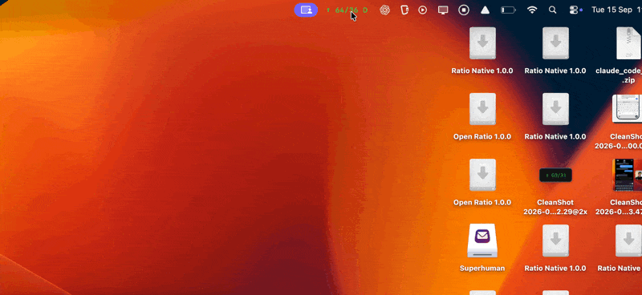

# Open Ratio – Create More. Consume Less.

A macOS menu bar app for noticing the balance between **Create** and **Consume**. There is no webview, network service, account, analytics or third-party dependency.

Download it [here](https://github.com/massimokris/open-ratio/releases/download/v1/Open-Ratio-1.0.0-universal.dmg) for free.

> This is an independent implementation inspired by [Ratio by Jack Butcher](https://x.com/jackbutcher/status/2099526332178629044). Is not the original source, an official distribution or an endorsed product. No proprietary executable or source was downloaded or reverse engineered.



## Install

Requires **macOS 13 or later**. The packaged app supports Apple Silicon and Intel Macs.

1. Open the latest `.dmg` file.
2. Drag **Open Ratio** into the **Applications** folder.
3. Eject the disk image and open **Open Ratio** from Applications.

Click the ratio in the menu bar to open the panel. To build the DMG yourself, use the commands under [Contributing](#contributing).

## Permissions the app needs

App tracking works without extra permissions.

**Automation (optional to Track Websites)** — lets Open Ratio read the active tab address in your default browser when you enable website tracking. It starts off. Safari, Chrome, Edge, Brave and Chromium are supported. Open Ratio saves only the hostname, such as `example.com`. Other browsers count as apps. If a site cannot be read or access is denied, tracking continues under the browser’s app name.

You can manage this access in **System Settings → Privacy & Security → Automation**.

## Architecture

**Native menu bar app** with no Dock icon. AppKit manages the menu bar item and the main `NSPanel`; SwiftUI shows tracking, history and settings inside it. `NSWorkspace` detects the active app, while `RatioCore` calculates tracked time and ratios. Optional website tracking reads the default browser through Apple Events. Activity is saved as JSON in `~/Library/Application Support/RatioNative/`, and preferences use `UserDefaults`. Demo data stays separate from real activity.

See [CONTEXT.md](CONTEXT.md) for domain terms and [docs/adr/](docs/adr/) for design decisions.

## Project structure

```text
Sources/
  RatioNative/          # Menu bar UI, app state and macOS/browser access
  RatioCore/            # Time tracking, ratios, history and local storage
Tests/
  RatioNativeTests/     # App and browser adapter tests
  RatioCoreTests/       # Accounting and storage tests
Resources/              # App icon, bundle metadata and permissions
scripts/                # Build the app, create the DMG and verify releases
docs/adr/               # Design decisions
Package.swift           # Swift package and build targets
CONTEXT.md              # Domain terms
AGENTS.md               # Instructions for coding agents
LICENSE                 # MIT license
```

## Contributing

PRs welcome. If you use Codex or Claude Code, point it at [AGENTS.md](AGENTS.md) and describe what you want to build.

For local development, install Xcode or the Command Line Tools with Swift 5.9 or later, then run:

```sh
swift build
swift test
./scripts/package-dmg.sh
```

The packaging script creates `dist/Open Ratio.app` and `dist/Open-Ratio-1.0.0-universal.dmg`. Keep time accounting separate from the UI and macOS adapters, and use system frameworks.

Got feedback? DM me on X [@massimokris](https://x.com/massimokris)